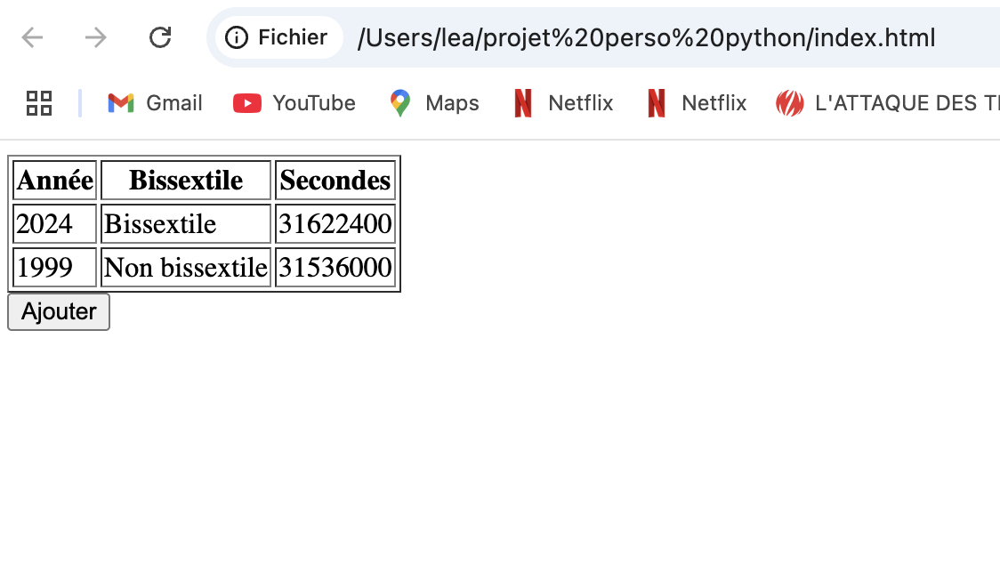

# 📆 Années Bissextiles – Projet HTML / JavaScript

Ce projet permet de déterminer si une année est bissextile et de calculer le nombre de secondes qu'elle contient.  
L'utilisateur peut saisir une année via un bouton, et le résultat s'affiche dynamiquement dans un tableau HTML.

---

## 🖼️ Aperçu du projet

Voici une capture d'écran du fonctionnement :



---

## 🚀 Fonctionnalités

- Vérification des années bissextiles (selon les règles officielles)
- Calcul dynamique du nombre de secondes dans l’année (365 ou 366 jours)
- Saisie manuelle d’une année via `prompt()`
- Affichage automatique dans un tableau HTML
- Gestion des erreurs de saisie

---

## 🛠️ Technologies utilisées

- **HTML5** : structure de la page
- **JavaScript** : logique de calcul, DOM, événements
- **Manipulation du DOM** : `getElementById`, `insertRow`, etc.
- **Boîte de dialogue utilisateur** : `prompt`, `alert`
- **Événement bouton** : `addEventListener`

---

## ▶️ Lancer le projet

1. Télécharge le projet ou clone le dépôt.
2. Ouvre simplement le fichier `index.html` dans un navigateur.
3. Clique sur **"Ajouter"** pour tester différentes années.

---
🎓 Projet pédagogique en JavaScript – Frontend simple sans framework

# 📅 Année Bissextile & Conversion en Secondes – Projet Python

Ce projet simple en Python permet à l'utilisateur d'entrer une année, de vérifier si elle est **bissextile** (ou non), et de calculer le **nombre de secondes** que contient cette année.

---

## 🧠 Objectifs pédagogiques

- Manipuler les **entrées utilisateur**
- Utiliser les **structures conditionnelles**
- Créer et utiliser des **fonctions personnalisées**
- Gérer les **exceptions (try/except)**
- Travailler avec des **boucles (`while`)**

---

## 📂 Contenu du programme

Le script permet de :
1. Demander à l’utilisateur de saisir une année (avec validation d’entrée)
2. Vérifier si l’année est bissextile
3. Afficher un message explicatif
4. Calculer et afficher le nombre total de secondes dans cette année

---

## 🚀 Exécution

Assurez-vous d’avoir Python installé (version 3.x recommandée).

```bash
python annee_bissextile.py
```

---

## 📌 Exemple d’utilisation

```
Veuillez entrer une année (entier positif) : 2024
L'année 2024 est bissextile.
✅ L'année 2024 est bissextile et contient 31622400 secondes.
```

--- 
🎓 Projet pédagogique – Apprentissage Python de base
